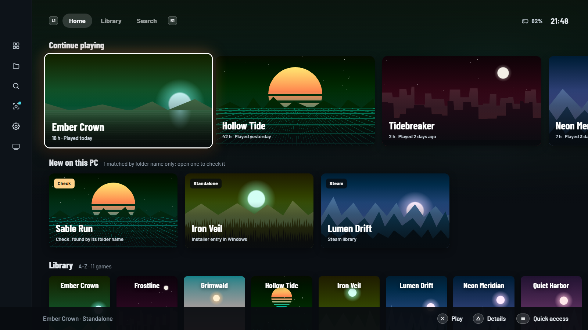
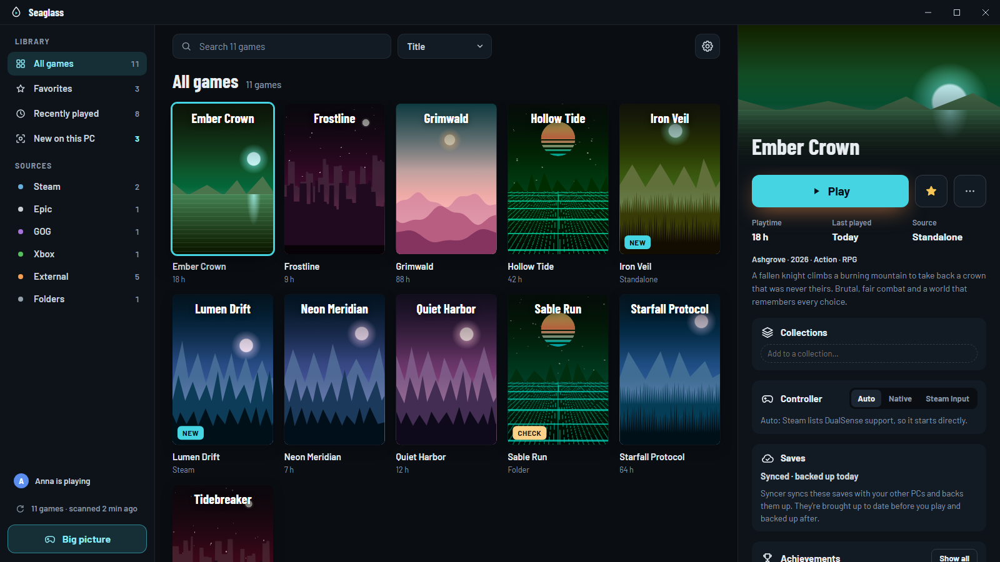
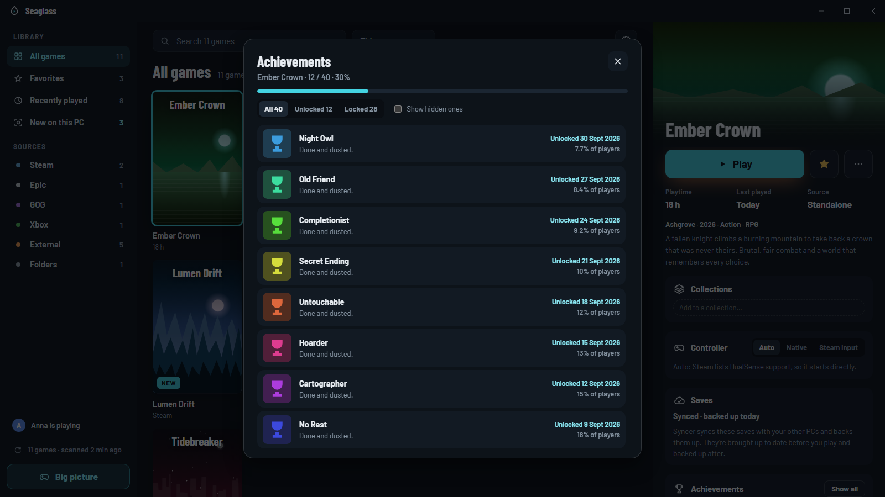

<p align="center"></p>

<h1 align="center">Seaglass Store Edition</h1>

<p align="center"><b>Seaglass with an experimental, opt-in store:</b> a catalog from the sources and feeds you choose, safety checks before anything runs, and installs without the installer's questions. It's <a href="https://github.com/ApolloF/Seaglass">Seaglass</a> plus the store, updated from Seaglass every day. It installs over Seaglass and keeps your library and settings; Seaglass installs back over it. See <a href="docs/experimental-store.md">docs/experimental-store.md</a>.</p>

<p align="center">A Windows game launcher that finds the games installed on your PC on its own, from store launchers and other sources alike, and plays great with a DualSense.</p>

<p align="center">
  <a href="https://github.com/ApolloF/Seaglass/releases/latest"></a>
  <a href="https://github.com/ApolloF/Seaglass/releases"></a>
  <a href="LICENSE"></a>
</p>

<p align="center"></p>

<p align="center"><sub>Formerly WaterLauncher. WaterLauncher doesn't update to Seaglass on its own: install Seaglass over it, and it keeps your library and settings.</sub></p>

---

**[Download Seaglass Store Edition](https://github.com/ApolloF/Seaglass-Store-Releases/releases/latest/download/Seaglass-setup.exe)** for Windows 10 and 11 (64-bit). It installs for your account only, without administrator rights, and keeps itself up to date from the signed releases in [ApolloF/Seaglass-Store-Releases](https://github.com/ApolloF/Seaglass-Store-Releases/releases), where the release notes are too. Plain Seaglass is at [ApolloF/Seaglass](https://github.com/ApolloF/Seaglass).

- Finds Steam, Epic, GOG, EA, Ubisoft, Battle.net and Xbox installs, plus games installed outside a store launcher (*external copies*, such as standalone and DRM-free installs and backups) and plain game folders, and works out which game each one is.
- Desktop mode for mouse and keyboard, and a big picture mode for controllers with three layouts to choose from (Deck, Console, Orbit).
- Starts games and tracks playtime. While you play, the interface closes to free memory, and the PS button opens an overlay over the game.
- DualSense first: native button glyphs, haptics, lightbar, and the PS button to open the launcher. Games without DualSense support start through Steam Input automatically.
- Works with [Syncer](https://github.com/ApolloF/syncer) to keep saves in sync before and after you play. *Settings → Saves* installs Syncer with one click.
- Hide whole libraries you don't want to see (*Settings → Library*), for example Xbox or external copies.

| Desktop mode | Achievements |
|---|---|
|  |  |

<sub>Screenshots use the demo library (`npm run dev:mock`), so the games and art are made up.</sub>

## Intended use

Seaglass is a library manager. It indexes, identifies and launches games that are already installed on your PC. It does not unlock or modify games, and it contains no tools to bypass copy protection, license checks or DRM.

The Store Edition adds an opt-in store, off until you turn it on in *Settings → Experimental*. It comes with no feeds and no catalog of its own, and it doesn't host, upload or distribute any games or files. When it's on, it reads public release listings from the sources selected in its settings and from feeds you add, and downloads what you choose through a qBittorrent client installed on your PC, which shares downloaded data with others while it runs. Seaglass doesn't check whether you have the right to download any release, or vouch for its authenticity.

What you add, download, install and share through the store is your responsibility. Only use sources and feeds you have the right to use, for games you're allowed to download and play under their license terms and the laws that apply to you.

Recognising a game installed outside a store launcher is a compatibility feature, so that every game on the PC can be found in one place; it is not an endorsement of how a copy was obtained. You are responsible for making sure that the games you install and play, and how you use them, comply with their license terms and the laws that apply to you.

Seaglass is an independent project and is not affiliated with, endorsed by or sponsored by Valve, Epic Games, GOG, Electronic Arts, Ubisoft, Blizzard, Microsoft or Sony. Their names and trademarks are used only to describe compatibility.

## Install and update

- **Installer:** `Seaglass-setup.exe` installs to `%LOCALAPPDATA%\Programs\Seaglass` with Start menu and desktop shortcuts. Uninstall from *Settings → Apps*; it asks before deleting your library.
- **Without installing:** `Seaglass.exe` from the same release runs from any folder.
- **Updates:** checked on GitHub when Seaglass starts, or by hand (*Settings → General*). New versions download in the background and install the next time Seaglass starts, or straight away while it waits in the tray. Each one must be signed with a release key that never leaves the maintainer's PC ([docs/RELEASING.md](docs/RELEASING.md)).
- **Start with Windows:** *Settings → General*. Seaglass then waits in the tray.
- **Games started elsewhere:** start a library game from Steam or a shortcut and Seaglass still counts its playtime and lets go of the controller (*Settings → Big picture → While playing*).
- **Command line:** `--play <id>` starts a game without the interface (for shortcuts), `--tray` starts in the tray, `--quit` closes a running Seaglass, `--diagnostics` writes a report to the desktop.
- **Something wrong?** *Settings → About → Copy diagnostics*, then *Report a problem*. If the interface won't open: `Seaglass.exe --diagnostics`.
- **Your data:** `%APPDATA%\Seaglass` (library, settings, encrypted keys, log) and `%LOCALAPPDATA%\Seaglass` (art, the game database, updates). Seaglass has no telemetry; [PRIVACY.md](PRIVACY.md) lists what it stores and which services it contacts.

Builds aren't code-signed yet, so SmartScreen may warn the first time: *More info → Run anyway*. See [SECURITY.md](SECURITY.md) for how Seaglass keeps you safe.

## Develop

Requirements: Go 1.27+, Node 24+, [Wails v3](https://v3.wails.io) (`go install github.com/wailsapp/wails/v3/cmd/wails3@v3.0.0-beta.26`).

```bash
wails3 build                              # bin/Seaglass.exe
wails3 task installer VERSION=v1.0.0 MAKENSIS="C:/Program Files (x86)/NSIS/makensis.exe"   # bin/Seaglass-setup.exe
go test ./...                             # backend tests
cd frontend && npm run check              # type-check the interface
cd frontend && npm run dev:mock           # interface in a browser with made-up games
WL_REAL_SCAN=1 go test -run RealScan -v ./internal/scan   # scan this PC and print what was found
```

The backend lives in `internal/`: `scan` (sources, external-copy detection, executable picking), `identify` (Ludusavi matching), `library` (the game library), `settings`, `meta` (metadata and art), `pad` (controllers through SDL3), `launch` (game sessions: hooks, process tracking, playtime), `syncer` (client for Syncer's launcher API), `owned` (owned games from Steam, GOG and Epic accounts), `update` (updates from GitHub releases), `sqlite` (read-only SQLite reader for GOG Galaxy), `steaminput` (Steam shortcuts for the Steam Input route), `app` (services the interface calls, windows and tray), plus small helpers (`lnk`, `platform`, `logx`). The installer is `build/windows/nsis/project.nsi`; signing is described in [docs/SIGNING.md](docs/SIGNING.md). Steam and game-database parsing comes from [gamekit](https://github.com/ApolloF/gamekit). The Svelte 5 interface is in `frontend/src`: `desktop/` for desktop mode, `bigpicture/` for the controller layouts, `overlay/` for the in-game overlay.

The DLSS Updater add-on host lives on the [`feature/dlss-addon`](https://github.com/ApolloF/Seaglass/tree/feature/dlss-addon) branch; [docs/dlss-addon.md](https://github.com/ApolloF/Seaglass/blob/feature/dlss-addon/docs/dlss-addon.md) there has ideas for bringing it back.

## Support

Seaglass is free and stays free: no pro tier, no locked features. If it's useful to you, you can [buy me a coffee](https://ko-fi.com/apollof). Starring the repo and filing good bug reports help just as much.

## License

[GNU Affero General Public License v3.0](LICENSE). Releases up to 1.4 (as WaterLauncher) were MIT licensed.

Seaglass includes third-party code and fonts under their own licenses (MIT, BSD, ISC, zlib and the SIL Open Font License for Barlow); see [THIRD_PARTY_NOTICES.txt](THIRD_PARTY_NOTICES.txt), which the installer also puts next to `Seaglass.exe`. After changing dependencies, regenerate it with `go run ./tools/notices` (CI checks that it is up to date).
